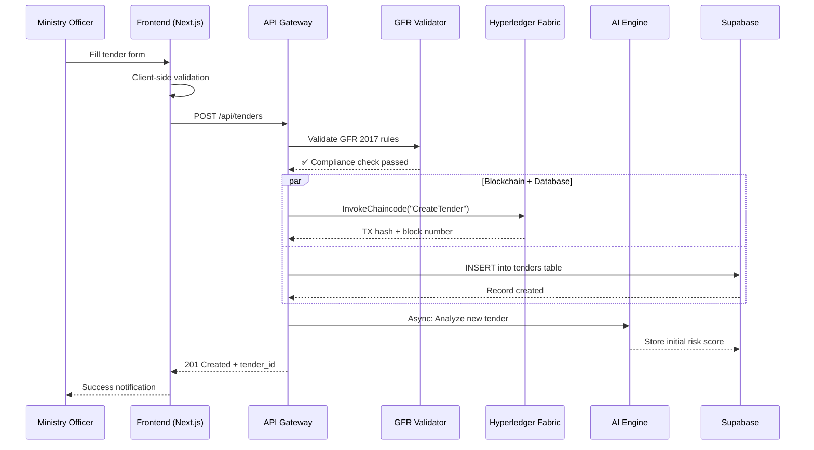
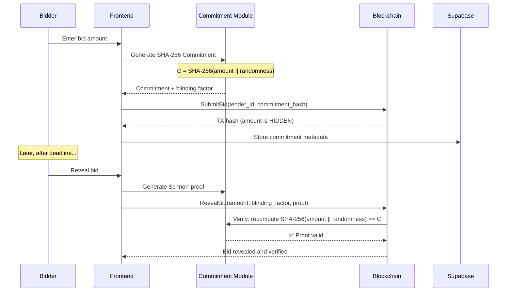
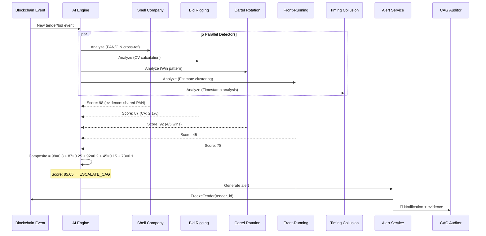
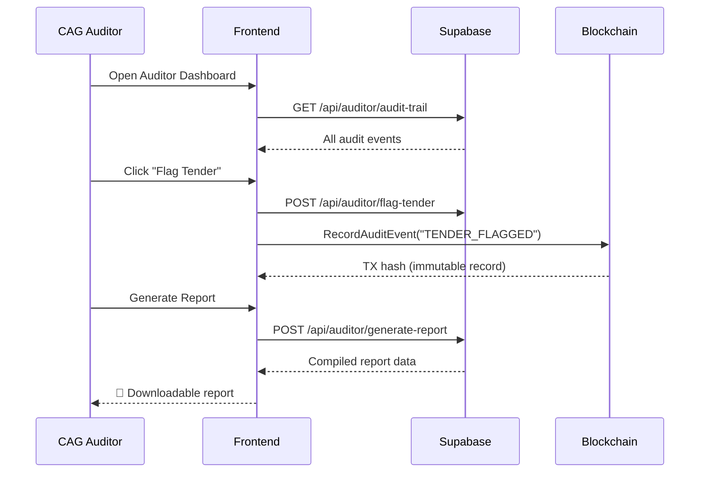

# 🔄 TenderShield — Data Flow Documentation

> Complete data flow for all major operations

---

## 1. Tender Creation Flow



---

## 2. Bid Submission Flow (Sealed Commitment)



---

## 3. AI Fraud Detection Flow



---

## 4. CAG Audit Flow



---

## 5. Error Handling & Failover Flow

```
Normal Flow:
  Request → API → Fabric + Supabase → Response

Fabric Down:
  Request → API → Fabric ❌ → Supabase (fallback) → Response
  (Data saved to Supabase, marked for Fabric sync later)

AI Engine Down:
  Request → AI Engine ❌ → Deterministic Engine → Response
  (Rule-based analysis used, flagged as "deterministic")

Network Timeout:
  Request → Timeout after 15s → Retry (2x with backoff) → Error UI
  (ErrorBoundary shows recovery options)

Supabase Down:
  Request → Supabase ❌ → Demo Data (in-memory) → Response
  (Demo mode activated automatically)
```

---

## 6. Authentication Flow

```
Login (Demo Mode):
  Click Demo Button → Set local token → Redirect to Dashboard

Login (Real Mode):
  Email + Password → Supabase Auth → JWT issued
  → Check user_verifications table
  → Route based on verification status:
    - Not verified → /register
    - Pending → /verify-pending
    - Rejected → /registration-rejected
    - Approved → /dashboard

Session Management:
  - JWT stored in Zustand (memory) + sessionStorage
  - Validated on each API call
  - Middleware checks token on protected routes
```
